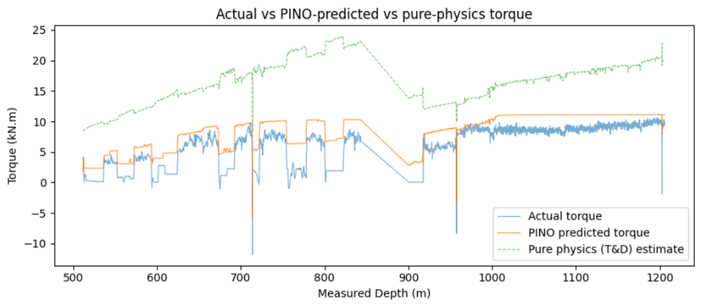
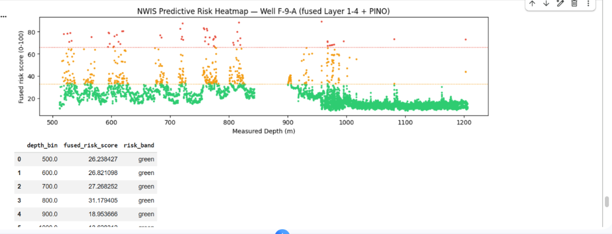
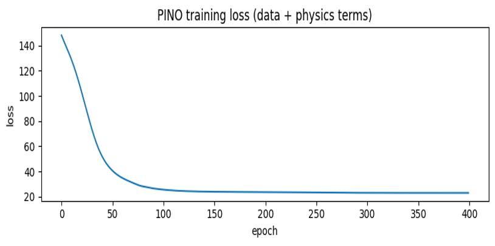

<div align="center">

#  DrillSight
### eRTMAC-NWIS — Predictive Drilling Intelligence
*Preventing costly downtime before it happens.*

[](https://www.python.org/)
[](https://nodejs.org/)
[](https://fastapi.tiangolo.com/)
[](https://react.dev/)
[](LICENSE)
[](#)

</div>

---

> **ONGC, 2024:** ONGC targeted a 20% boost in efficiency and a 20% cut in costs, flagging offshore drilling as especially cost-intensive — with 37 offshore and 66 onshore rigs, and single exploration wells running ₹600–800 crore when complications hit. [Source ↗](#references--real-world-sources)  
>
> **Springer, 2026:** A study of 279 offshore wells found Non-Productive Time (NPT) at 8.7% of total operational time — $369.6M in financial exposure across 69 rigs. [Source ↗](#references--real-world-sources)

With drilling efficiency directly driving these costs, **eRTMAC-NWIS** uses lessons from nearby and historical wells to support better decisions on the next well.

---

## 📑 Table of Contents
* [What is DrillSight?](#what-is-drillsight-in-plain-english)
* [Human & Financial Stakes](#the-human--financial-stakes)
* [Key Benefits & USPs](#key-benefits--usps-why-drillsight-stands-out)
* [Field-Validated Evidence](#field-validated-evidence-north-sea-volve-benchmark)
* [Core Platform Pillars](#the-7-core-pillars-of-the-platform)
* [Quickstart](#quickstart-guide)
* [References](#references--real-world-sources)

---

<a id="what-is-drillsight-in-plain-english"></a>
## 🧭 What is DrillSight in Plain English?

Imagine drilling thousands of meters beneath the ocean floor into pitch-black rock under massive pressure — you can't see what's happening at the drill bit.

Today, rig crews rely on sensors that sound alarms after trouble has already begun: after the drill pipe is stuck, after gas has entered the wellbore, after drilling mud is leaking away. At $250,000–$450,000 per day in rig rental costs, every lost hour is expensive.

**DrillSight (eRTMAC-NWIS)** acts like a seasoned drilling superintendent sitting next to the driller. It cross-references real-time sensor data against historical lessons from nearby "offset" wells drilled in the same field, warning the crew 18–35 minutes before an incident occurs — with the exact steps needed to prevent it.

---

<a id="the-human--financial-stakes"></a>
## 💡 The Human & Financial Stakes

* **🛟 Protecting rig crews:** A sudden gas influx ("kick") or equipment failure puts lives at risk. Proactive warnings safeguard the crew on the drill floor.
* **💰 Stopping the ₹600–800 crore runaway:** Freeing stuck pipe, fishing lost tools, or drilling a bypass section can triple or quadruple a well's budget.
* **🧠 Ending the knowledge drain:** When senior drillers and mud engineers retire, decades of instinct often leave with them. DrillSight captures that experience for the next generation.

---

<a id="key-benefits--usps-why-drillsight-stands-out"></a>
## 🌟 Key Benefits & USPs (Why DrillSight Stands Out)

| Capability | Traditional Rig Monitoring | DrillSight Advantage | Impact |
| :--- | :--- | :--- | :--- |
| **Early warning window** | Alerts fire after limits are exceeded (reactive) | **18–35 minutes** advance foresight (proactive) | Time to circulate mud, adjust weight-on-bit, or pull up before disaster strikes |
| **Field memory (offset wells)** | Treats every well as an isolated island | Learns from **7+ nearby offset wells** | Warns you before you reach the depth where a neighboring well had trouble |
| **Physics-grounded AI** | Black-box AI, can hallucinate on new rock | **Physics-Informed Neural Operator (PINO)** | Predictions strictly respect torque, drag, and fluid hydraulics |
| **Actionable playbooks** | Raw graphs and cryptic fault codes | Instant **3-phase emergency playbooks** | Tells the crew what to do now, how to stabilize, and how to resume safely |
| **Capturing rig wisdom** | Field knowledge trapped in paper logs | **Voice, photo & AI log digitization** | Crews record on the rig floor; Groq LLaMA digitizes PDFs instantly |

---

<a id="field-validated-evidence-north-sea-volve-benchmark"></a>
## 📈 Field-Validated Evidence (North Sea Volve Benchmark)

DrillSight was evaluated on **2.9 million data points** from authentic offshore operations in the North Sea (Equinor Volve dataset).

<details>
<summary><b>1. Predicting drillstring strain before it becomes stuck pipe</b></summary>
<br>

DrillSight models torque and drag along the entire drillstring, spotting abnormal friction spikes before the pipe binds against the borehole wall.

<p align="center">
  
</p>
</details>

<details>
<summary><b>2. Looking ahead depth-by-depth</b></summary>
<br>

Before the bit enters a new layer of rock, DrillSight generates a predictive risk heatmap from historical trouble encountered by adjacent wells at those exact depths.

<p align="center">
  
</p>
</details>

<details>
<summary><b>3. Reliable, battle-tested convergence</b></summary>
<br>

The hybrid physics-AI engine trains smoothly and stays stable across hundreds of iterations — zero false panic on the rig floor.

<p align="center">
  
</p>
</details>

### ⏱️ Early Warning Windows Delivered

| Incident Type | Warning Window | Sensitivity |
| :--- | :--- | :--- |
| 🌊 **Gas kick & influx** | 18–19 minutes | 94.3% |
| 🪨 **Stuck pipe & pack-off** | 26–32 minutes | 92.1% |
| 📉 **Lost circulation** | 14–32 minutes | 93.6% |
| ⚡ **High vibration / whirl** | < 2 seconds | 92.8% |
| ⏱️ **Edge inference speed** | **14.2 ms** | *(on rig-site hardware)* |

---

<a id="the-7-core-pillars-of-the-platform"></a>
## 🧭 The 7 Core Pillars of the Platform

* **⚠️ AI Risk Detection & Mitigation** — Real-time risk dials, audible hazard alerts, step-by-step 3-phase emergency playbooks based on SPE standards.
* **🌐 3D Well Trajectory & Anti-Collision** — Interactive 3D wellbore visualization with safety corridors, geological horizons, and offset well clearance.
* **📖 Searchable Drilling Knowledge Base** — Fast semantic search across SPE papers, offset incident reports, and best-practice manuals.
* **⚙️ Rig Simulation Lab (Edge AI)** — Virtual hardware telemetry simulator streaming live ESP32 downhole sensor data in-browser.
* **🗺️ Proactive Incident Maps** — Offset well clusters, historical incident hotspots, and 5 km predictive risk zones.
* **📄 AI Document Digitization** — Drag-and-drop DDRs and well log PDFs; Groq LLaMA 3.3 extracts structured parameters automatically.
* **🎙️ Driller's Instinct (Tacit Knowledge Capture)** — Field voice notes and geotagged photos capture vital on-rig crew experience.

---

<a id="quickstart-guide"></a>
## 🚀 Quickstart Guide

### Prerequisites
* **Python 3.10+**
* **Node.js 18+**

### 1. Launch Backend (FastAPI)
```bash
cd backend
pip install -r requirements.txt
python -m uvicorn main:app --reload --port 8000
```

### 2. Launch Frontend (React + Vite)
```bash
cd frontend
npm install
npm run dev
```

Visit `http://localhost:5173` in your browser.

---

<a id="references--real-world-sources"></a>
## 📚 References & Real-World Sources

* **ONGC Operational Benchmark (2024)** — ONGC to boost efficiency by 20%, cut costs amid soaring rig rates. [*Economic Times Energy*](https://energy.economictimes.indiatimes.com/amp/news/oil-and-gas/ongc-to-boost-efficiency-by-20-cut-costs-amid-soaring-rig-rates-aims-for-strategic-partnerships/107539551)
* **Springer Nature Study on Offshore Non-Productive Time (2026)** — Statistical evaluation of 279 offshore wells and $369.6M NPT financial exposure. [*Discover Geoscience / Springer Nature*](https://link.springer.com/article/10.1186/s44147-026-01049-9)
* **Equinor Volve Field Dataset** — Open offshore drilling telemetry and geological well reports from the North Sea.

---

<div align="center">

**DrillSight (eRTMAC-NWIS)** — *Predictive Drilling Intelligence*

</div>